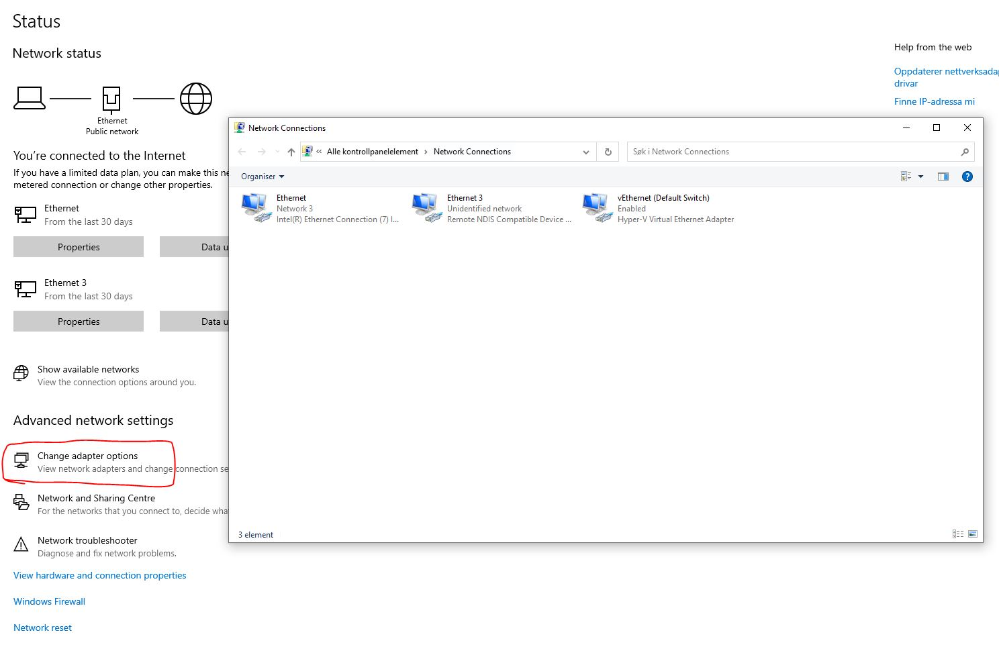
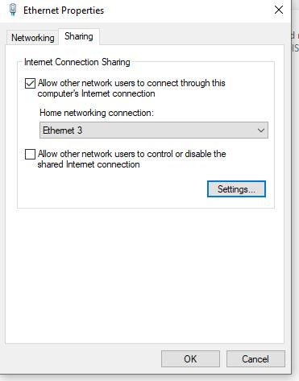
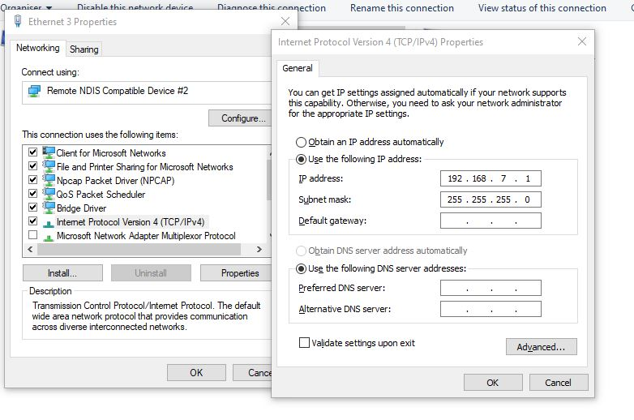

# BeagleBone setup
## Download and install 
### Debian 11.x Bullseye
* Known to work with am335x-debian-11.5-minimal-armhf-2022-11-01-2gb.img.xz
* https://forum.beagleboard.org/t/debian-11-x-bullseye-monthly-snapshots/31280

### Balena etcher 
* https://www.balena.io/etcher/

## Setup
### Share internet connection with pocketbeagle
- Network/device settings (remember to set static ip on the beaglebone ethernet adapter after sharing the connection.   
  
  
  

### Connect to the Pocketbeagle with ssh/serial connectiong

```bash command-line
~$ sudo route add default gw 192.168.7.1
~$ sudo vi /etc/resolv.conf
```
Add:
```
nameserver 8.8.8.8
```
And run the following commands:
```bash command-line
~$ sudo apt-get update && sudo apt-get upgrade 
```
